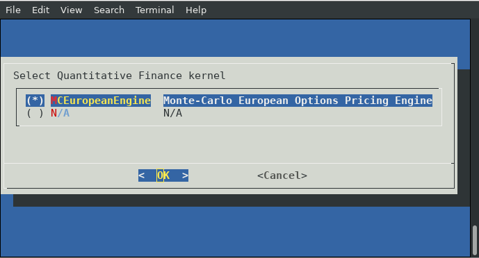
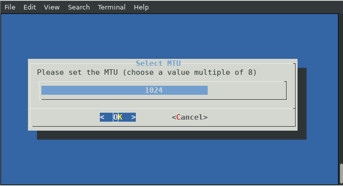

## cFp_Vitis

[](https://travis.ibm.com/cloudFPGA/cFp_Vitis)  [](https://opensource.org/licenses/Apache-2.0)

cloudFPGA project (cFp) for Xilinx Vitis library

- [Project documentation](https://pages.github.ibm.com/cloudFPGA/Doc/pages/project_repository.html#cfp-vitis)
- [Code documentation](https://pages.github.ibm.com/cloudFPGA/Dox/group__cFp__Vitis.html)

**Idea**: The `cFp_Vitis` project bridges the accelerated libraries of open source [Vitis Libraries](https://github.com/Xilinx/Vitis_Libraries) to [cloudFPGA](https://pages.github.ibm.com/cloudFPGA/Doc/index.html) platform.
```
   CPU(OpenCL/OpenCV)  -->  FPGA (Vitis HLS C++)  -->  FPGA (Vitis HLS C++)
    /\__________________________________________________|
```


### System configurattion

#### Ubuntu

Assuming Ubuntu >16.04 the folowing packages should be installed:
```
sudo apt-get install -y build-essential pkg-config libxml2-dev python3-opencv libjpeg-dev libpng-dev libopencv-dev libopencv-contrib-dev rename rpl dialog cmake gcc-multilib(=for vitis)
```

You may also need these steps for Ubuntu 18.04 & Vitis 2019.2 :
```
sudo apt-get install libjpeg62
wget http://se.archive.ubuntu.com/ubuntu/pool/main/libp/libpng/libpng12-0_1.2.54-1ubuntu1_amd64.deb
sudo apt-get install ./libpng12-0_1.2.54-1ubuntu1_amd64.deb 
rm ./libpng12-0_1.2.54-1ubuntu1_amd64.deb
```

#### CentOS/EL7
```
sudo yum groupinstall 'Development Tools'
sudo yum install cmake opencv-devel dialog python-numpy libxml2-devel python3 wireshark wireshark-gnome xauth rpl
```

### Vivado/Vitis tool support

The versions below are supported by cFp_Vitis. As of today we follow a hybrid development approach
where a specific part of `SHELL` code is synthesized using `Vivado 2017.4`, while the rest of the 
HLS, Synthesis, P&R and bitgen are carried over with `Vivado 2019.x`.

#### For the SHELL (cFDK's code)

- [x] 2017
  - [x] 2017.4
- [ ] 2018
- [ ] 2019
- [ ] 2020

#### For the ROLE (user's code)

- [ ] 2017
- [ ] 2018
- [x] 2019
  - [x] 2019.1
  - [x] 2019.2
- [x] 2020
  - [x] 2020.1


### Vitis libraries support

The following Vitis accelerated libraries are supported by cFp_Vitis:

- [ ] BLAS
- [ ] Data Compression
- [ ] Database
- [ ] DSP
- [x] Quantitative Finance
  - [x] [MC European Engine](./ROLE/quantitative_finance/hls/mceuropeanengine)
- [ ] Security
- [ ] Solver
- [x] Vision
  - [x] [Gamma Correction](./ROLE/vision/hls/gammacorrection)
  - [x] [Harris](./ROLE/vision/hls/harris/)
  
  

### Quick cFp_Vitis configuration






#### Usefull commands

- Connect to ZYC2 network through openvpn:

  `sudo openvpn --config zyc2-vpn-user.ovpn --auth-user-pass up-user`

- Connect to a ZYC2 x86 node:

  `ssh -Y ubuntu@10.12.2.100`

- On Wireshark filter line:

  `udp.port==2718` or `tcp.port==2718`

  `ip.addr == 10.12.200.0/24`
  
- Set maximum net buffer:

  - `sudo sysctl -w net.core.rmem_max=2147483647`
  - On the host code (cpp)
    ```
    //increase buffer size
    int recvBufSize = 0x1000000;
    int err = setsockopt(sock, SOL_SOCKET, SO_RCVBUF, &recvBufSize, sizeof(recvBufSize));
    if(err != 0)
    {
      std::cerr <<" error socket buffer: " << err << std::endl;
      exit(EXIT_FAILURE);
    }
    int real_buffer_size = 0;
    socklen_t len2 = sizeof(real_buffer_size);
    err = getsockopt(sock, SOL_SOCKET, SO_RCVBUF, &real_buffer_size, &len2);
    printf("got %d as buffer size (requested %d)\n",real_buffer_size/2, recvBufSize);
    if(real_buffer_size/2 != recvBufSize)
    {
      std::cerr << "set SO_RCVBUF failed! got only: " << real_buffer_size/2 << "; trying to continue..." << std::endl;
    }
  ```

- Quick bitgen:

  sometimes it accelerates the build process of `make monolithic` if:
  execute after a successfull build `make save_mono_incr` and then build the new with `make monolithic_incr` or `make monolithic_debug_incr`
  
- Update subrepositories (e.g. for Vitis_Libraries)

  On the pc that you want to change the subrepo to a new version
  ```
  cd Vitis_Libraries
  git checkout origin master` (or any other version)
  git commit -am "Updated Vitis_Libraries to master"
  ```
  On the pc you want to sync with the new subrepo
  ```
  git submodule update --init -- Vitis_Libraries/
  ```
- Add user to wireshark group in order to capture packets without advanced privileges. (needs logout)
  ```
  sudo usermod -aG wireshark $USER
  ```
