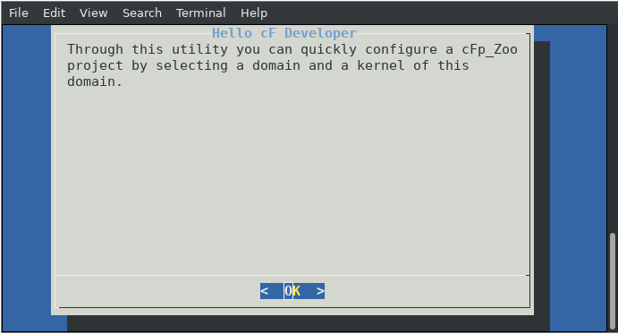
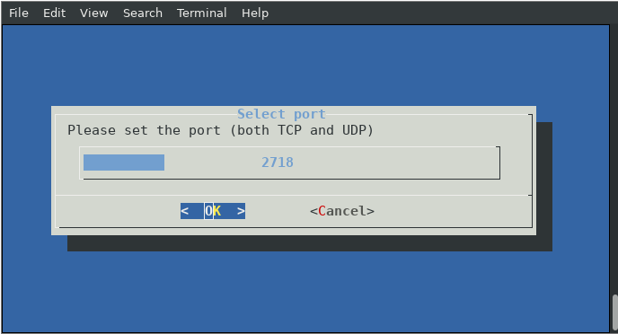

# cFp_Zoo Overview

[](https://opensource.org/licenses/Apache-2.0)

cFp_Zoo is a cloudFPGA project (cFp) featuring domain-specific accelerators for the hybrid multi-cloud era.

- [Project documentation](https://cloudfpga.github.io/Doc/pages/PROJECTS/cFp_Zoo_overview.html)
- [Code documentation](https://cloudfpga.github.io/Dox/group__cFp__Zoo.html)

**Idea**: The `cFp_Zoo` project develops numerous domain-specific accelerators, incuding those from the open source library [Vitis Libraries](https://github.com/Xilinx/Vitis_Libraries) to the [cloudFPGA](https://cloudfpga.github.io/Doc/index.html) platform.


## System configurattion

### Ubuntu

Assuming Ubuntu >16.04 the folowing packages should be installed:
```
sudo apt-get install -y build-essential pkg-config libxml2-dev python3-opencv libjpeg-dev libpng-dev libopencv-dev libopencv-contrib-dev rename rpl dialog cmake swig python3-dev python3.8-venv gcc-multilib
```

You may also need these steps for Ubuntu 18.04 & Vitis 2019.2 :
```
sudo apt-get install libjpeg62
wget http://se.archive.ubuntu.com/ubuntu/pool/main/libp/libpng/libpng12-0_1.2.54-1ubuntu1_amd64.deb
sudo apt-get install ./libpng12-0_1.2.54-1ubuntu1_amd64.deb 
rm ./libpng12-0_1.2.54-1ubuntu1_amd64.deb
```

### CentOS/EL7
```
sudo yum groupinstall 'Development Tools'
sudo yum install cmake opencv-devel dialog python-numpy libxml2-devel python3 wireshark wireshark-gnome xauth rpl
```

## Vivado/Vitis tool support

The versions below are supported by cFp_Zoo.

#### For the SHELL (cFDK's code)

- [x] 2017
  - [x] 2017.4
- [x] 2018
- [x] 2019
  - [x] 2019.1
  - [x] 2019.2 
- [X] 2020
  - [x] 2020.1
  - [ ] 2020.2
- [ ] 2021

### For the ROLE (user's code)

- [ ] 2017
- [ ] 2018
- [x] 2019
  - [x] 2019.1
  - [x] 2019.2
- [x] 2020
  - [x] 2020.1
  - [ ] 2020.2
- [ ] 2021


## cFp_Zoo supported libraries

cFp_Zoo features several accelerated functionalities in the form of libraries which include:
* the C++ code that can be synthesized through Xilinx Vivado HLS tool into RTL code and further implemented into a network-attached FPGA through [cFDK](https://github.com/cloudFPGA/cFDK/). This code is under the [ROLE](https://github.com/cloudFPGA/cFp_Zoo/tree/master/ROLE) directory.
* the C++ and/or Python host code, which can be executed on a bare-metal or VM-based host, which is in the same network with the aforementioned network-attached FPGA, and interact with it using network sockets. This code is under the [HOST](https://github.com/cloudFPGA/cFp_Zoo/tree/master/HOST) directory.

We provide support for the following libraries: 

### IBM ZRL libraries support

The following accelerated libraries are developed from IBB ZRL and are supported by cFp_Zoo:

- [x] [Uppercase](./ROLE/custom/hls/uppercase)
- [x] [Memory Test](./ROLE/custom/hls/memtest)


### Vitis libraries support

The following Vitis accelerated libraries are supported by cFp_Zoo:

- [ ] BLAS
- [ ] Codec
- [ ] Database
- [ ] Data Analytics
- [ ] Data Compression
- [ ] DSP
- [ ] Graph
- [ ] HPC
- [x] Quantitative Finance
  - [x] [MC European Engine](./ROLE/quantitative_finance/hls/mceuropeanengine)
- [ ] Security
- [ ] Solver
- [ ] Sparce
- [ ] Utilities
- [x] Vision
  - [x] [Gamma Correction](./ROLE/vision/hls/gammacorrection)
  - [x] [Harris](./ROLE/vision/hls/harris/)
  - [x] [MedianBlur](./ROLE/vision/hls/median_blur/)
  - [x] [Sobel Filter](./ROLE/vision/hls/sobel/)
  - [x] [Warp Transform](./ROLE/vision/hls/warp_transform/)


## Getting started
  
We provide a 6-steps flow to create an FPGA bitstream with a cFp_Zoo accelerated application and and launch it on cloudFPGA platform. 

### Step-1: Clone the project

```
git clone --recursive https://github.com/cloudFPGA/cFp_Zoo.git
cd cFp_Zoo
git checkout main
```

### Step-2: Setup your environment

```
source env/setenv.sh
```

### Step-3: Configure cFp_Zoo








### Step-4: Generate a static bitstream

After configuring a project with a selected accerelated kernel, you can initiate the synthesis and bitstream generation by issuing the following command:

```
make monolithic
```
You find your newly created bitstream in the folder `cFp_Zoo/dcps`, under the name `4_topFMKU60_impl_<ROLE>_monolithic.bit`.

### Step-5: Upload the bitstream to cloudFPGA Resource Manager

After generated a bitstream you can upload it to the cloudFPGA Resource Manager (cFRM).
There are two ways to interact with cFRM:
* A web-based graphical user interface to cFRM's API. It is available as a [Swagger UI](https://swagger.io/tools/swagger-ui/) at [http://10.12.0.132:8080/ui](http://10.12.0.132:8080/ui).
* A command-line tool which interacts with cFRM's API: [cFSP](https://github.com/cloudFPGA/cFSP).

Here we cover the 2nd option, i.e. cFSP.

* [Install cFSP](https://cloudfpga.github.io/Doc/pages/CFSPHERE/cfsp.html#installation-usage)
* [Load your credentials](https://cloudfpga.github.io/Doc/pages/CFSPHERE/cfsp.html#id3)
* Upload the image `4_topFMKU60_impl_vision_monolithic.bit`
  ```
    $ ./cfsp image post --image_file=<path>/cFp_Zoo/4_topFMKU60_impl_vision_monolithic.bit
  ```
  

  Write down the image "*id*" for use in the next step, e.g. `74462cd5-20e3-4228-a47d-258b7e5e583a`.

### Step-6: Launch the application

After uploading a bitstream you can program an FPGA with it. In addition, to launch the application you need a host where you can execute the software that interacts with this FPGA. Both the host and the FPGA need to be in the same network to communicate through network sockets. To help with such configurations, we have extended cFRM with the ability to create `clusters` of hosts and FPGAs. 

Assuming you want to create a cluster with
* one CPU node from ZYC2 with `ip=10.12.2.100`
* one FPGA from cloudFPGA platform with the previously uloaded FPGA image with id `74462cd5-20e3-4228-a47d-258b7e5e583a`

```
./cfsp cluster post --image_id=74462cd5-20e3-4228-a47d-258b7e5e583a --node_ip=10.12.2.100
```


Write down the "*role_ip*" for later accessing your cluster's FPGA. e.g. 10.12.200.184

Then you need to login to the host:

```
ssh centos@10.12.2.100
```

Prepare the environment to execute the host software:

```
git clone --recursive https://github.com/cloudFPGA/cFp_Zoo.git
cd cFp_Zoo
source env/setenv.sh
```

Execute the host software (e.g. for the `harris` kernel of `vision` domain):
```
cd HOST/vision/harris/languages/cplusplus
mkdir build && cd build
cmake ../
make -j 4
./harris_host 10.12.200.184 2718 <image.png>
```


## cFp_Zoo Essentials

#### Firewall issues

Some firewalls may block network packets if there is not a connection to the remote machine/port.
Hence, to get the Triangle example to work, the following commands may be necessary to be executed 
(as root):

```
$ firewall-cmd --zone=public --add-port=2718-2750/udp --permanent
$ firewall-cmd --zone=public --add-port=2718-2750/tcp --permanent
$ firewall-cmd --reload
```

Also, ensure that the network secuirty group settings are updated (e.g. in case of the ZYC2 OpenStack).


### Usefull commands

- Connect to ZYC2 network through openvpn:

  `sudo openvpn --config zyc2-vpn-user.ovpn --auth-user-pass up-user`

- Connect to a ZYC2 x86 node:

  `ssh -Y ubuntu@10.12.2.100`

- On Wireshark filter line:

  `udp.port==2718` or `tcp.port==2718`

  `ip.addr == 10.12.200.0/24`
  
- Set maximum net buffer:

  - `sudo sysctl -w net.core.rmem_max=2147483647`
  - On the host code (cpp)
    ```
    //increase buffer size
    int recvBufSize = 0x1000000;
    int err = setsockopt(sock, SOL_SOCKET, SO_RCVBUF, &recvBufSize, sizeof(recvBufSize));
    if(err != 0)
    {
      std::cerr <<" error socket buffer: " << err << std::endl;
      exit(EXIT_FAILURE);
    }
    int real_buffer_size = 0;
    socklen_t len2 = sizeof(real_buffer_size);
    err = getsockopt(sock, SOL_SOCKET, SO_RCVBUF, &real_buffer_size, &len2);
    printf("got %d as buffer size (requested %d)\n",real_buffer_size/2, recvBufSize);
    if(real_buffer_size/2 != recvBufSize)
    {
      std::cerr << "set SO_RCVBUF failed! got only: " << real_buffer_size/2 << "; trying to continue..." << std::endl;
    }
  ```

- Quick bitgen:

  sometimes it accelerates the build process of `make monolithic` if:
  execute after a successfull build `make save_mono_incr` and then build the new with `make monolithic_incr` or `make monolithic_debug_incr`
  
- Update subrepositories (e.g. for Vitis_Libraries)

  On the pc that you want to change the subrepo to a new version
  ```
  cd Vitis_Libraries
  git checkout origin master` (or any other version)
  git commit -am "Updated Vitis_Libraries to master"
  ```
  On the pc you want to sync with the new subrepo
  ```
  git submodule update --init -- Vitis_Libraries/
  ```
- Add user to wireshark group in order to capture packets without advanced privileges. (needs logout)
  ```
  sudo usermod -aG wireshark $USER
  ```
