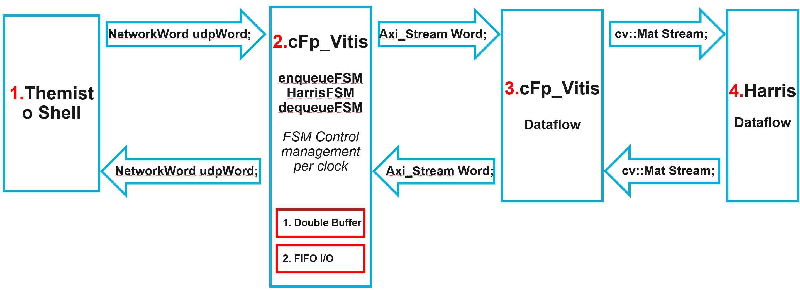

## cFp_Vitis

[](https://travis.ibm.com/cloudFPGA/cFp_Vitis)  [](https://opensource.org/licenses/Apache-2.0)

cloudFPGA project (cFp) for Xilinx Vitis library

- [Project documentation](https://pages.github.ibm.com/cloudFPGA/Doc/pages/example_projects.html#cfp-vitis)
- [Code documentation](https://pages.github.ibm.com/cloudFPGA/Dox/group__cFp__Vitis.html)

**Idea**: The `cFp_Vitis` project bridges the accelerated libraries of open source [Xilinx Vitis](https://github.com/Xilinx/Vitis_Libraries) to [cloudFPGA](https://pages.github.ibm.com/cloudFPGA/Doc/index.html) platform.
```
   CPU(OpenCL/OpenCV)  -->  FPGA (Vitis HLS C++)  -->  FPGA (Vitis HLS C++)
    /\__________________________________________________|
```


### System configurattion

#### Ubuntu

Assuming Ubuntu >16.04 the folowing packages should be installed:
```
sudo apt-get install -y build-essential pkg-config libxml2-dev python3-opencv libjpeg-dev libpng-dev libopencv-dev libopencv-contrib-dev rename rpl
```

You may also need these steps for Ubuntu 18.04 & Vitis 2019.2 :
```
sudo apt-get install libjpeg62
wget http://se.archive.ubuntu.com/ubuntu/pool/main/libp/libpng/libpng12-0_1.2.54-1ubuntu1_amd64.deb
sudo apt-get install ./libpng12-0_1.2.54-1ubuntu1_amd64.deb 
rm ./libpng12-0_1.2.54-1ubuntu1_amd64.deb
```

#### CentOS/EL7
```
sudo yum groupinstall 'Development Tools'
sudo yum install cmake opencv-devel
```

### Vitis libraries support

The following Vitis accelerated libraries are supported by cFp_Vitis:

- [ ] BLAS
- [ ] Data Compression
- [ ] Database
- [ ] DSP
- [ ] Quantitative Finance
- [ ] Security
- [ ] Solver
- [x] Vision
  - [x] gammacorrection
  - [x] harris

### Vivado/Vitis tool support

The versions below are supported by cFp_Vitis. As of today we follow a hybrid development approach
where a specific part of `SHELL` code is synthesized using `Vivado 2017.4`, while the rest of the 
HLS, Synthesis, P&R and bitgen are carried over with `Vivado 2019.x`.

#### For the SHELL (cFDK's code)

- [x] 2017
  - [x] 2017.4
- [ ] 2018
- [ ] 2019
- [ ] 2020

#### For the ROLE (user's code)

- [ ] 2017
- [ ] 2018
- [x] 2019
  - [x] 2019.1
  - [x] 2019.2
- [x] 2020
  - [x] 2020.1

  
#### Vitis Vision Harris Corner Detector dive in 


##### Repository and environment setup

```bash
git clone --recursive git@github.ibm.com:cloudFPGA/cFp_Vitis.git
cd cFp_Vitis
source ./env/setenv.sh
```


##### Intergration of Vitis Vision Harris with cloudFPGA

In the following figure it is shown how straightforward is to intergrate a function from Vitis libraries with cloudFPGA project.



Since most of Vitis libraries (in L1) are offered with a AXI stream I/F in dataflow mode, the most obvious approach to connect them to cF is to wrap this 
I/F with anohter I/F that takes care of carefully feeding (as well as sending the results back) to (from) the Harris IP from the network. 
For cFp_Vitis we are using the Themisto Shell already equipeed with a network streaming I/F for the user application. 
A small FSM takes care of the data casting between network and AXI streams.


##### Harris Simulation 

The testbench of Harris is highlighted below:


The testbench is offered in two flavors:
- HLS TB: The testbench of the C++/RTL. This is a typical Vivado HLS testbench but it includes the testing of Harris IP when this is wrapped in a [cF Themisto Shell](https://pages.github.ibm.com/cloudFPGA/Doc/pages/cfdk.html#the-themisto-sra).
- Host TB: This includes the testing of a a host apllication (C++) that send/receives images over Ethernet (TCP/UDP) with a cF FPGA. This testbench establishes a socket-based connection with an intermediate listener which further calls the previous testbench. So practically, the 2nd tb is a wrapper of the 1st tb, but passing the I/O data over socket streams.
  For example this is the `system command` inside `Host TB` that calls the `HLS TB`:
  
  ```c
  // Calling the actual TB over its typical makefile procedure, but passing the save file
  string str_command = "cd ../../../../ROLE/vision/hls/harris/ && " + clean_cmd + "\
  INPUT_IMAGE=./test/input_from_udp_to_fpga.png " + exec_cmd + " && \
  cd ../../../../HOST/vision/harris/build/ "; 
  const char *command = str_command.c_str(); 
  cout << "Calling TB with command:" << command << endl; 
  system(command); 
  ```

Basic files/modules:
  1. [harris_host.cpp](https://github.ibm.com/cloudFPGA/cFp_Vitis/blob/master/ROLE/vision/host/harris/src/harris_host.cpp): The end-user application. This is the application that a user can execute on a x86 host and send an image to the FPGA for processing with Harris Corner Detector algorithm. This file is part of both the `HLS TB` and the `Host TB`
  2. [harris_host_fw_tb.cpp](https://github.ibm.com/cloudFPGA/cFp_Vitis/blob/master/ROLE/vision/host/harris/src/harris_host_fwd_tb.cpp): The intermediate listener for socket connections from an end-user application. This file is part only of the `Host TB`.
  3. [test_harris_app.cpp](https://github.ibm.com/cloudFPGA/cFp_Vitis/blob/master/ROLE/vision/hls/harris_app/src/harris_app.cpp): The typical Vivado HLS testbench of Harris IP, when this is wrapped in a Themisto Shell.
  4. [Themisto Shell](https://pages.github.ibm.com/cloudFPGA/Doc/pages/cfdk.html#the-themisto-sra): The SHELL-ROLE architecture of cF.
  5. [cFp_Vitis](https://github.ibm.com/cloudFPGA/cFp_Vitis): The project that bridges Vitis libraries with cF.

  
###### Harris image size 

The maximum image size, that the Harris IP is configured, is defined at https://github.ibm.com/cloudFPGA/cFp_Vitis/blob/master/ROLE/vision/host/harris/include/config.h 
through the `FRAME_HEIGHT` and `FRAME_WIDTH` definitions. These definitions have an impact of the FPGA resources. In the following simulations if the image 
provided has other dimensions, the `cv::resize` function will be used to adjust the image (scale) to `FRAME_HEIGHT x FRAME_WIDTH`.
  
**Note:** Remember to run `make clean` every time you change those definitions.
  
###### Run simulation

**HLS TB**
  
```bash
cd ./ROLE/vision/hls/harris_app
make fcsim -j 4  # to run simulation using your system's gcc (with 4 threads)
make csim   # to run simulation using Vivado's gcc
make cosim  # to run co-simulation using Vivado
```

**Optional steps**

```bash
cd ./ROLE/vision/hls/harris_app
make callgraph # to run fcsim and then execute the binary in Valgrind's callgraph tool
make kcachegrind # to run callgrah and then view the output in Kcachegrind tool
make memcheck # to run fcsim and then execute the binary in Valgrind's memcheck tool (to inspect memory leaks)
```

**Host TB**
  
```bash
# Compile sources
cd ./HOST/vision/harris
mkdir build && cd build
cmake ../
make -j 2

# Start the intermediate listener
# Usage: ./harris_host_fwd_tb <Server Port> <optional simulation mode>
./harris_host_fwd_tb 1234 0

# Start the actual user application on host
# Open another terminal and prepare env
cd cFp_Vitis
source ./env/setenv.sh
cd ./HOST/vision/harris/build
# Usage: ./harris_host <Server> <Server Port> <optional input image>
./harris_host localhost 1234 ../../../../ROLE/vision/hls/harris/test/8x8.png

# What happens is that the user application (harris_host) is sending an input image file to 
# intermediate listener (harris_host_fwd_tb) through socket. The latter receives the payload and 
# reconstructs the image. Then it is calling the HLS TB by firstly compiling the HLS TB files. The 
# opposite data flow is realized for taking the results back and reconstruct the FPGA output image.
# You should expect the output in the file <optional input image>_fpga_out_frame_#.png
eog ../../../../ROLE/vision/hls/harris/test/8x8.png_fpga_points_out_frame_1.png

```

##### Harris Synthesis

Since curretnly the cFDK supports only Vivado(HLS) 2017.4 we are following a 2-steps synthesis 
procedure. Firstly we synthesize the Themisto SHELL with Vivado (HLS) 2017.4 and then we synthesize 
the rest of the project (including P&R and bitgen) with Vivado (HLS) > 2019.1. 

###### The Themisto SHELL
```bash
cd cFp_Vitis/cFDK/SRA/LIB/SHELL/Themisto
make all # with Vivado HLS == 2017.4
```

###### The complete cFp_Vitis
```bash
cd cFp_Vitis
make monolithic # with Vivado HLS >= 2019.1
```

Optional HLS only for the Harris IP (e.g. to check synthesizability)
```bash
cd cFp_Vitis/ROLE/vision/hls/harris_app
make csynth # with Vivado HLS >= 2019.1
```


##### Harris cF Demo

TODO: Flash a cF FPGA node with the generated bitstream and note down the IP of this FPGA node. e.g. assuming `10.12.200.153` and port `2718`


```bash
cd ./ROLE/vision/host/harris
mkdir build && cd build
cmake ../
make -j 2
cd cFp_Vitis/ROLE/vision/host/harris/build
# Usage: ./harris_host <Server> <Server Port> <optional input image>
./harris_host 10.12.200.153 2718 ../../../../ROLE/vision/hls/harris/test/8x8.png
# You should expect the output in the file <optional input image>_fpga_out_frame_#.png
eog ../../../../ROLE/vision/hls/harris/test/8x8.png_fpga_points_out_frame_1.png

```

##### Usefull commands

- Connect to ZYC2 network through openvpn:

  `sudo openvpn --config zyc2-vpn-user.ovpn --auth-user-pass up-user`

- Connect to a ZYC2 x86 node:

  `ssh -Y ubuntu@10.12.2.100`

- On Wireshark filter line:

  `udp.port==2718` or `tcp.port==2718`
  
- Quick bitgen:

  sometimes it accelerates the build process of `make monolithic` if:
  execute after a successfull build `make save_mono_incr` and then build the new with `make monolithic_incr` or `make monolithic_debug_incr`

- Editing videos for input to the Harris example:
  
  `ffmpeg -i The_Mast_Walk_by_Alex_Thomson.mp4 -ss 00:00:39 -t 00:00:17 -async 1 -strict -2 cut.mp4 -c copy`
  `frame= 1025 fps= 42 q=-1.0 Lsize=   10487kB time=00:00:41.00 bitrate=2095.0kbits/s   `
  `ffmpeg -i cut.mp4 -filter:v "crop=720:720:200:20" -strict -2 cut_720x720.mp4`

##### Working with ZYC2

All communication goes over the *UDP/TCP port 2718*. Hence, the CPU should run:
```bash
$ ./harris_host <Server> <Server Port> <optional input image>
```

The packets will be send from Host (CPU) Terminal 1 to FPGA and they will be received back in the 
same terminal by a single host application using the `sendTo()` and `receiveFrom()` socket methods.

For more details, `tcpdump -i <interface> -nn -s0 -vv -X port 2718` could be helpful.

The *Role* can be replicated to many FPGA nodes in order to create a pipline of processing.
Which destination the packets will have is determined by the `node_id`/`node_rank` and `cluster_size`
(VHDL ports`piFMC_ROLE_rank` and `piFMC_ROLE_size`).

The **Role can be configured to forward the packet always to `(node_rank + 1) % cluster_size`** 
(for UDP and TCP packets), so this example works also for more or less then two FPGAs, actually.
curretnly, the default example supports one CPU node and one FPGA node.


For distributing the routing tables, **`POST /cluster`** must be used.
The following depicts an example API call, assuming that the cFp_Vitis bitfile was uploaded as 
image`d8471f75-880b-48ff-ac1a-baa89cc3fbc9`:


### Firewall issues

Some firewalls may block network packets if there is not a connection to the remote machine/port.
Hence, to get the Triangle example to work, the following commands may be necessary to be executed 
(as root):

```
$ firewall-cmd --zone=public --add-port=2718-2750/udp --permanent
$ firewall-cmd --reload
```

Also, ensure that the network secuirty group settings are updated (e.g. in case of the ZYC2 OpenStack).
