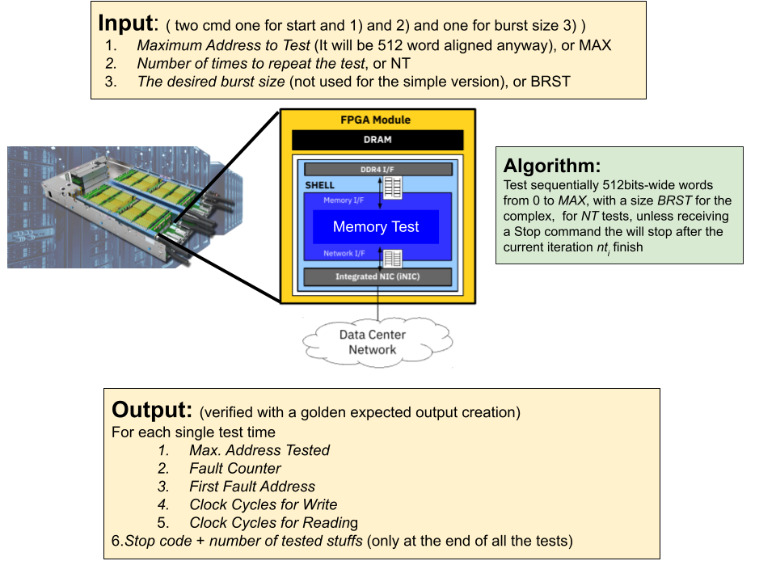
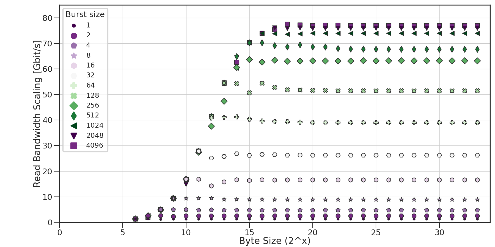

# cFp_Memtest

cloudFPGA project (cFp) for changing characters case of a user phrase. The purpose of this project 
is to establish a starting point for a full-stack software developer with a usefull API for common 
programming languanges and development frameworks.





## System configurattion

### Ubuntu

Assuming Ubuntu >16.04 the folowing packages should be installed:
```
sudo apt-get install -y build-essential pkg-config libxml2-dev rename rpl python3-dev python3-venv swig curl
```


### CentOS/EL7
```
sudo yum groupinstall 'Development Tools'
sudo yum install cmake
```


## Full-stack software support

The following programming languanges are currently supported (and are on the roadmap)

- [x] C/C++
- [ ] Java
- [ ] Python
- [ ] Javascript

The following programming frameworks are currently supported (and are on the roadmap)

- [ ] [Jupyter Notebook / Jupyter Lab](https://jupyter.org/)
- [ ] [Spark](https://spark.apache.org/)

The following socket libraries are currently supported (and are on the roadmap)

- [x] [Practical Sockets](http://cs.ecs.baylor.edu/~donahoo/practical/CSockets/practical/)
- [ ] [Asio](https://think-async.com/Asio/)
- [ ] [ZeroMQ](https://zeromq.org/)
- [ ] [WebSockets](https://developer.mozilla.org/en-US/docs/Web/API/WebSockets_API)


The following containerization software is currently supported (and is on the roadmap)

- [ ] [Docker](www.docker.com)
- [ ] [Kubernetes](https://kubernetes.io/)
- [ ] [Red Hat OpenShift Community Distribution of Kubernetes](https://www.okd.io/)

## Vivado tool support

The versions below are supported by cFp_Memtest. As of today we follow a hybrid development approach
where a specific part of `SHELL` code is synthesized using `Vivado 2017.4`, while the rest of the 
HLS, Synthesis, P&R and bitgen are carried over with `Vivado 2019.x`.

### For the SHELL (cFDK's code)

- [x] 2017
  - [x] 2017.4
- [ ] 2018
- [ ] 2019
- [ ] 2020

### For the ROLE (user's code)

- [ ] 2017
- [ ] 2018
- [x] 2019
  - [x] 2019.1
  - [x] 2019.2
- [x] 2020
  - [x] 2020.1

  

#### Repository and environment setup

```bash
git clone --recursive-submodules git@github.ibm.com:cloudFPGA/cFp_Vitis.git
cd cFp_Vitis
source ./env/setenv.sh
```

#### Memtest Simulation 

The testbench is offered in two flavors:
- HLS TB: The testbench of the C++/RTL. This is a typical Vivado HLS testbench but it includes the testing of Memtest IP when this is wrapped in a [cF Themisto Shell](https://pages.github.ibm.com/cloudFPGA/Doc/pages/cfdk.html#the-themisto-sra).
- Host TB: This includes the testing of a a host apllication (C++) that send/receives strings over Ethernet (TCP/UDP) with a cF FPGA. This testbench establishes a socket-based connection with an intermediate listener which further calls the previous testbench. So practically, the 2nd tb is a wrapper of the 1st tb, but passing the I/O data over socket streams.
  For example this is the `system command` inside `Host TB` that calls the `HLS TB`:
  
  ```
  // Calling the actual TB over its typical makefile procedure, but passing the save file
  string str_command = "cd ../../../../../../ROLE/custom/hls/memtest/ && " + clean_cmd + "\
  INPUT_STRING=4096 TEST_NUMBER=2 BURST_SIZE=512 " + exec_cmd + " && \
  cd ../../../../../../HOST/custom/memtest/languages/cplusplus/build/ "; 
  const char *command = str_command.c_str(); 
  cout << "Calling TB with command:" << command << endl; 
  system(command); 
  ```

The Makefile pass as argument to the TB the following params:
1. `INPUT_STRING` is the maxmimum target address (e.d., max 1000000 or 1MB)
2. `TEST_NUMBER` is the number of repetitions of the test 
3. `BURST_SIZE` is the desired burst size

##### Simulation example: 

``` make csim INPUT_STRING=4096 TEST_NUMBER=2 BURST_SIZE=512 ```

Basic files/modules:
  1. [memtest_host.cpp](https://github.ibm.com/cloudFPGA/cFp_Vitis/blob/master/HOST/custom/memtest/languages/cplusplus/src/memtest_host.cpp): The end-user application. This is the application that a user can execute on a x86 host and send a string to the FPGA for processing with Memtest function. This file is part of both the `HLS TB` and the `Host TB`
  2. [memtest_host_fw_tb.cpp](https://github.ibm.com/cloudFPGA/cFp_Vitis/blob/master/HOST/custom/memtest/languages/cplusplus/src/memtest_host_fwd_tb.cpp): The intermediate listener for socket connections from an end-user application. This file is part only of the `Host TB`.
  3. [test_memtest.cpp](https://github.ibm.com/cloudFPGA/cFp_Vitis/blob/master/ROLE/custom/hls/memtest/test/test_memtest.cpp): The typical Vivado HLS testbench of Memtest IP, when this is wrapped in a Themisto Shell.
  4. [Themisto Shell](https://pages.github.ibm.com/cloudFPGA/Doc/pages/cfdk.html#the-themisto-sra): The SHELL-ROLE architecture of cF.
  5. [cFp_Memtest](https://github.ibm.com/cloudFPGA/cFp_Vitis): The project that bridges Memtest libraries with cF.
   
**Note:** Remember to run `make clean` every time you change those definitions.
###### Memory test modularity
Modularity of the memory test:
1. [`src/memtest.cpp`](https://github.ibm.com/cloudFPGA/cFp_Vitis/blob/master/ROLE/custom/hls/memtest/src/memtest.cpp) contains the **TOP** module where you may find the three coarse grained stage: Port&Dst//RX - Processing - TX
2. [`include/memtest.hpp`](https://github.ibm.com/cloudFPGA/cFp_Vitis/blob/master/ROLE/custom/hls/memtest/include/memtest.cpp) is the **TOP** level **HEADER** with some info on the most basic **COMMANDS** such as a **start/stop** for a controllable execution
3. [`include/memtest_library.hpp`](https://github.ibm.com/cloudFPGA/cFp_Vitis/blob/master/ROLE/custom/hls/memtest/include/memtest_library.hpp) contains the **library** for some **basic cF** components: Port&Dst, RX, TX, Memory R/W utilities, Performance counter utilities
4. [`include/memtest_processing.hpp`](https://github.ibm.com/cloudFPGA/cFp_Vitis/blob/master/ROLE/custom/hls/memtest/include/memtest_processing.hpp) contains a **template structure** of a **processing** function for the cF environment for a start/stop approach with commands management, processing, and output management. There are example of processing functions for the memory test
5. [`include/memtest_pattern_library.hpp`](https://github.ibm.com/cloudFPGA/cFp_Vitis/blob/master/ROLE/custom/hls/memtest/include/memtest_pattern_library.hpp) contains the functions used to developed the **custom processing** algorithm of the memory test: pattern generator functions, read functions, write functions.

A developer might replace the command handling, and the processing with their own one.
To this extent, the modifications are minimal and referred mostly to the processing functions.

###### Run simulation

**HLS TB**
  
```bash
cd ./ROLE/custom/hls/memtest/
make fcsim -j 4  # to run simulation using your system's gcc (with 4 threads)
make csim   # to run simulation using Vivado's gcc
make cosim  # to run co-simulation using Vivado
```

**Optional steps**

```bash
cd ./ROLE/custom/hls/memtest/
make callgraph # to run fcsim and then execute the binary in Valgrind's callgraph tool
make kcachegrind # to run callgrah and then view the output in Kcachegrind tool
make memcheck # to run fcsim and then execute the binary in Valgrind's memcheck tool (to inspect memory leaks)
```

**Host TB**
  
```bash
# Compile sources
cd ./HOST/custom/memtest/languages/cplusplus
mkdir build && cd build
cmake ../
make -j 2

# Start the intermediate listener
# Usage: ./memtest_host_fwd_tb <Server Port> <optional simulation mode>
./memtest_host_fwd_tb 1234 0

# Start the actual user application on host
# Open another terminal and prepare env
cd cFp_Memtest
source ./env/setenv.sh
./HOST/custom/memtest/languages/cplusplus/build
# Usage: ./memtest_host <Server> <Server Port> <number of address to test> <testing times> <burst size> <optional list/interactive mode (type list or nothing)>
./memtest_host 10.12.200.153 1234 4096 2 512
#interactive mode
# You should expect the output in the stdout and a log in a csv file for both average results and single tests
./memtest_host 10.12.200.153 1234 1 1 1 list
# benchmarking mode, running for a fixed number of times the benchmark from the biggest burst size to the shortest
# on incremental number of addresses

# What happens is that the user application (memtest_host) is sending an input string to 
# intermediate listener (memtest_host_fwd_tb) through socket. The latter receives the payload and 
# reconstructs the string. Then it is calling the HLS TB by firstly compiling the HLS TB files. The 
# opposite data flow is realized for taking the results back and reconstruct the FPGA output string.
# You should expect the string output in the stdout.
```

#### Memtest Synthesis

Since curretnly the cFDK supports only Vivado(HLS) 2017.4 we are following a 2-steps synthesis 
procedure. Firstly we synthesize the Themisto SHELL with Vivado (HLS) 2017.4 and then we synthesize 
the rest of the project (including P&R and bitgen) with Vivado (HLS) > 2019.1. 

By default the Memory Test will come with `#define SIMPLER_BANDWIDTH_TEST` commented. Which means that you will use the complex memory test that can handle any variable burst size. 
To change this just decomment the define.

##### The Themisto SHELL 

```bash
cd cFp_Vitis/cFDK/SRA/LIB/SHELL/Themisto
make all # with Vivado HLS == 2017.4
```

##### The complete cFp_Memtest

```bash
cd cFp_Vitis
make monolithic # with Vivado HLS >= 2019.1
```

Optional HLS only for the Memtest IP (e.g. to check synthesizability)
```bash
cd cFp_Vitis/ROLE/custom/hls/memtest/
make csynth # with Vivado HLS >= 2019.1
```


#### Memtest cF Demo

TODO: Flash a cF FPGA node with the generated bitstream and note down the IP of this FPGA node. e.g. assuming `10.12.200.153` and port `2718`

```bash
cd ./HOST/custom/memtest/languages/cplusplus/
mkdir build && cd build
cmake ../
make -j 2
# Usage: ./memtest_host <Server> <Server Port> <number of address to test> <testing times> <burst size> <optional list/interactive mode (type list or nothing)>
./memtest_host 10.12.200.153 2718 4096 2 512
#interactive mode
# You should expect the output in the stdout and a log in a csv file for both average results and single tests
./memtest_host 10.12.200.153 2718 1 1 1 list
# benchmarking mode, running for a fixed number of times the benchmark from the biggest burst size to the shortest
# on incremental number of addresses
```

**NOTE:** The cFp_Memtest ROLE (FPGA part) is equipped with both the UDP and TCP offload engines. At 
runtime, on host, to select one over the other, you simply need to change in [config.h](https://github.ibm.com/cloudFPGA/cFp_Vitis/blob/master//HOST/custom/memtest/languages/cplusplus/include/config.h) 
file the define `#define NET_TYPE udp` (choose either udp or tcp).


##### JupyterLab example

NOT UP TO DATE
```bash
cd HOST/langauges/python
mkdir build
cd build
cmake ../
make -j 2
python3 -m venv env     # to create a local dev environment
                        # note you will have a "env" before the prompt to remind
                        # you the local environment you work in
source env/bin/activate # 
pip3 install -r ../requirements.txt # to be improved : some errors might occur depending on environment
```


#### Usefull commands

- Connect to ZYC2 network through openvpn:

  `sudo openvpn --config zyc2-vpn-user.ovpn --auth-user-pass up-user`

- Connect to a ZYC2 x86 node:

  `ssh -Y ubuntu@10.12.2.100`

- On Wireshark filter line:

  `udp.port==2718` or `tcp.port==2718`
  
- Quick bitgen:

  sometimes it accelerates the build process of `make monolithic` if:
  execute after a successfull build `make save_mono_incr` and then build the new with `make monolithic_incr` or `make monolithic_debug_incr`

- Docker:
  `docker exec -it distracted_ishizaka /bin/bash`

- Possible resources/stack limitation on Linux-based systems:
  ` ulimit -a` to see the current limitations
  ` ulimit -c unlimited` to unlimit  "The maximum size of core files created" 
  ` ulimit -s unlimited` to unlimit "The maximum stack size."

#### Working with ZYC2

All communication goes over the *UDP/TCP port 2718*. Hence, the CPU should run:
```bash
$ ./memtest_host <Server> <Server Port> <input string>
```

The packets will be send from Host (CPU) Terminal 1 to FPGA and they will be received back in the 
same terminal by a single host application using the `sendTo()` and `receiveFrom()` socket methods.

For more details, `tcpdump -i <interface> -nn -s0 -vv -X port 2718` could be helpful.

The *Role* can be replicated to many FPGA nodes in order to create a pipline of processing.
Which destination the packets will have is determined by the `node_id`/`node_rank` and `cluster_size`
(VHDL ports`piFMC_ROLE_rank` and `piFMC_ROLE_size`).

The **Role can be configured to forward the packet always to `(node_rank + 1) % cluster_size`** 
(for UDP and TCP packets), so this example works also for more or less then two FPGAs, actually.
curretnly, the default example supports one CPU node and one FPGA node.


For distributing the routing tables, **`POST /cluster`** must be used.
The following depicts an example API call, assuming that the cFp_Memtest bitfile was uploaded as 
image`d8471f75-880b-48ff-ac1a-baa89cc3fbc9`:


## Firewall issues

Some firewalls may block network packets if there is not a connection to the remote machine/port.
Hence, to get the Triangle example to work, the following commands may be necessary to be executed 
(as root):

```
$ firewall-cmd --zone=public --add-port=2718-2750/udp --permanent
$ firewall-cmd --zone=public --add-port=2718-2750/tcp --permanent
$ firewall-cmd --reload
```

Also, ensure that the network secuirty group settings are updated (e.g. in case of the ZYC2 OpenStack).

## Memory test Results 
Follows some expected outputs of the memory test in the simple (i.e., free running) and the complex version (i.e., burst controlled).
First some analysis of the burst controlled bandwidth for the read and the write.
Analyzing power of two memory sizes starting from 64 bytes (i.e., one 512bits word)
### Bandwidth Burst Control Results
Burst: 1 -- > 512 (power of two)
1. Read 
2. Write
#### Bandwidth write results variable burst sizes

#### Bandwidth read results variable burst sizes


### Bandwidth read and write results comparison simple and complex memory tests (i.e. free-running vs burst cntrlled)

