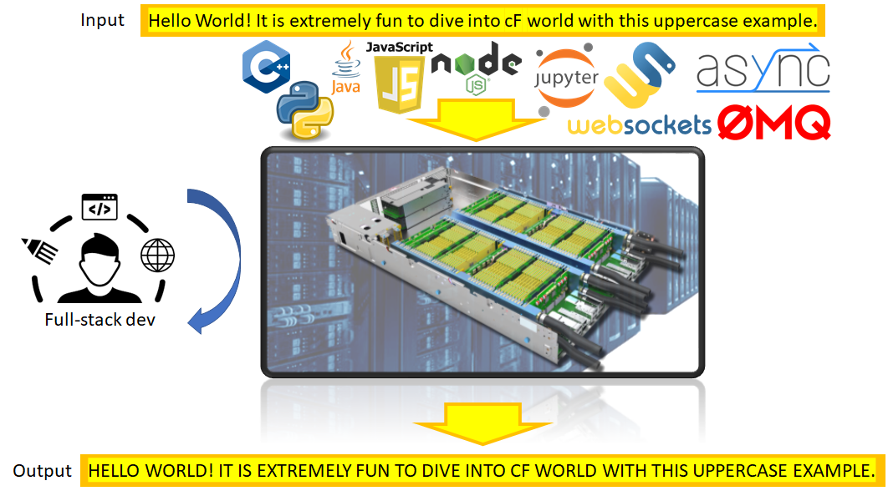

# cFp Uppercase

A cloudFPGA project (cFp) for converting a string to an upper-case one. The purpose of this project 
is to act as a "HelloWorld" example of Themisto Shell. In adition it aims to provide a starting point 
for a full-stack software developer with a usefull API for common programming languanges and development frameworks.





## System configurattion

[Same as cFp_Zoo](https://cloudfpga.github.io/Doc/pages/PROJECTS/cFp_Zoo_overview.html#system-configurattion) 
## Full-stack software support

The following programming languanges are currently supported (and are on the roadmap)

- [x] C/C++
- [ ] Java
- [x] Python
- [ ] Javascript

The following programming frameworks are currently supported (and are on the roadmap)

- [x] [Jupyter Notebook / Jupyter Lab](https://jupyter.org/)
- [ ] [Spark](https://spark.apache.org/)

The following socket libraries are currently supported (and are on the roadmap)

- [x] [Practical Sockets](http://cs.ecs.baylor.edu/~donahoo/practical/CSockets/practical/)
- [ ] [Asio](https://think-async.com/Asio/)
- [ ] [ZeroMQ](https://zeromq.org/)
- [ ] [WebSockets](https://developer.mozilla.org/en-US/docs/Web/API/WebSockets_API)


The following containerization software is currently supported (and is on the roadmap)

- [x] [Docker](www.docker.com)
- [ ] [Kubernetes](https://kubernetes.io/)
- [ ] [Red Hat OpenShift Community Distribution of Kubernetes](https://www.okd.io/)

## Vivado tool support

[Same with cFp_Zoo](https://cloudfpga.github.io/Doc/pages/PROJECTS/cFp_Zoo_overview.html#vivado-vitis-tool-support)


#### Repository and environment setup

```bash
git clone --recursive git@github.ibm.com:cloudFPGA/cFp_Zoo.git
cd cFp_Zoo
bash config.sh
<Navigate through menu and seect Custom->Uppercase>
source ./env/setenv.sh
```

#### Uppercase Simulation 

The testbench is offered in two flavors:
- HLS TB: The testbench of the C++/RTL. This is a typical Vivado HLS testbench but it includes the testing of Uppercase IP when this is wrapped in a [cF Themisto Shell](https://pages.github.ibm.com/cloudFPGA/Doc/pages/cfdk.html#the-themisto-sra).
- Host TB: This includes the testing of a a host apllication (C++) that send/receives strings over Ethernet (TCP/UDP) with a cF FPGA. This testbench establishes a socket-based connection with an intermediate listener which further calls the previous testbench. So practically, the 2nd tb is a wrapper of the 1st tb, but passing the I/O data over socket streams.
  For example this is the `system command` inside `Host TB` that calls the `HLS TB`:
  
  ```c
  // Calling the actual TB over its typical makefile procedure, but passing the save file
  string str_command = "cd ../../../../ROLE/1/hls/uppercase/ && " + clean_cmd + "\
  INPUT_STRING=input_string " + exec_cmd + " && \
  cd ../../../../HOST/uppercase/build/ "; 
  const char *command = str_command.c_str(); 
  cout << "Calling TB with command:" << command << endl; 
  system(command); 
  ```

Basic files/modules:
  1. [uppercase_host.cpp](https://github.com/cloudFPGA/cFp_Zoo/blob/HEAD/HOST/custom/uppercase/languages/cplusplus/src/uppercase_host.cpp): The end-user application. This is the application that a user can execute on a x86 host and send a string to the FPGA for processing with Uppercase function. This file is part of both the `HLS TB` and the `Host TB`
  2. [uppercase_host_fw_tb.cpp](https://github.com/cloudFPGA/cFp_Zoo/blob/HEAD/HOST/custom/uppercase/languages/cplusplus/src/uppercase_host_fwd_tb.cpp): The intermediate listener for socket connections from an end-user application. This file is part only of the `Host TB`.
  3. [test_uppercase.cpp](https://github.com/cloudFPGA/cFp_Zoo/blob/HEAD/ROLE/custom/hls/uppercase/test/test_uppercase.cpp): The typical Vivado HLS testbench of Uppercase IP, when this is wrapped in a Themisto Shell.
  4. [Themisto Shell](https://pages.github.ibm.com/cloudFPGA/Doc/pages/cfdk.html#the-themisto-sra): The SHELL-ROLE architecture of cF.
  5. [cFp_Uppercase](https://github.ibm.com/cloudFPGA/cFp_Uppercase): The project that bridges Uppercase libraries with cF.

  
  
**Note:** Remember to run `make clean` every time you change those definitions.
  
##### Run simulation

**HLS TB**
  
```bash
cd ./ROLE/1/hls/uppercase
make fcsim -j 4  # to run simulation using your system's gcc (with 4 threads)
make csim   # to run simulation using Vivado's gcc
make cosim  # to run co-simulation using Vivado
```

**Optional steps**

```bash
cd ./ROLE/1/hls/uppercase
make callgraph # to run fcsim and then execute the binary in Valgrind's callgraph tool
make kcachegrind # to run callgrah and then view the output in Kcachegrind tool
make memcheck # to run fcsim and then execute the binary in Valgrind's memcheck tool (to inspect memory leaks)
```

**Host TB**
  
```bash
# Compile sources
cd ./HOST/uppercase
mkdir build && cd build
cmake ../
make -j 2

# Start the intermediate listener
# Usage: ./uppercase_host_fwd_tb <Server Port> <optional simulation mode>
./uppercase_host_fwd_tb 1234 0

# Start the actual user application on host
# Open another terminal and prepare env
cd cFp_Uppercase
source ./env/setenv.sh
cd ./HOST/uppercase/build
# Usage: ./uppercase_host <Server> <Server Port> <input string>
./uppercase_host localhost 1234 "HelloWorld"

# What happens is that the user application (uppercase_host) is sending an input string to 
# intermediate listener (uppercase_host_fwd_tb) through socket. The latter receives the payload and 
# reconstructs the string. Then it is calling the HLS TB by firstly compiling the HLS TB files. The 
# opposite data flow is realized for taking the results back and reconstruct the FPGA output string.
# You should expect the string output in the stdout.
```

#### Uppercase Synthesis

```bash
cd cFp_Zoo/
make monolithic # with Vivado HLS >= 2019.1
```

Optional HLS only for the Uppercase IP (e.g. to check synthesizability)
```bash
cd cFp_Zoo/ROLE/custom/hls/uppercase/
make csynth # with Vivado HLS >= 2019.1 and <= 2020.1
```


#### Uppercase Demo (C++)

TODO: Flash a cF FPGA node with the generated bitstream and note down the IP of this FPGA node. e.g. assuming `10.12.200.153` and port `2718`


```bash
cd cFp_Zoo/HOST/custom/uppercase/languages/cplusplus/
mkdir build && cd build
cmake ../
make -j 2
# Usage: ./uppercase_host <Server> <Server Port> <input string>
./uppercase_host 10.12.200.153 2718 "HelloWorld"
# You should expect the output in the stdout
```

**NOTE:** The cFp_Uppercase ROLE (FPGA part) is equipped with both the UDP and TCP offload engines. At 
runtime, on host, to select one over the other, you simply need to change in [config.h](https://github.com/cloudFPGA/cFp_Zoo/blob/master/HOST/custom/uppercase/languages/cplusplus/include/config.h) file the define `#define NET_TYPE udp` (choose either udp or tcp).


##### JupyterLab example

```bash
cd cFp_Zoo/HOST/custom/uppercase/languages/python/
mkdir build && cd build
cmake ../
make -j 2
python3 -m venv env     # to create a local dev environment
                        # note you will have a "env" before the prompt to remind
                        # you the local environment you work in
source env/bin/activate # 
pip3 install -r ../requirements.txt # to be improved : some errors might occur depending on environment
```


#### Working with ZYC2

All communication goes over the *UDP/TCP port 2718*. Hence, the CPU should run:
```bash
$ ./uppercase_host <Server> <Server Port> <input string>
```

The packets will be send from Host (CPU) Terminal 1 to FPGA and they will be received back in the 
same terminal by a single host application using the `sendTo()` and `receiveFrom()` socket methods.

For more details, `tcpdump -i <interface> -nn -s0 -vv -X port 2718` could be helpful.

The *Role* can be replicated to many FPGA nodes in order to create a pipline of processing.
Which destination the packets will have is determined by the `node_id`/`node_rank` and `cluster_size`
(VHDL ports`piFMC_ROLE_rank` and `piFMC_ROLE_size`).

The **Role can be configured to forward the packet always to `(node_rank + 1) % cluster_size`** 
(for UDP and TCP packets), so this example works also for more or less then two FPGAs, actually.
