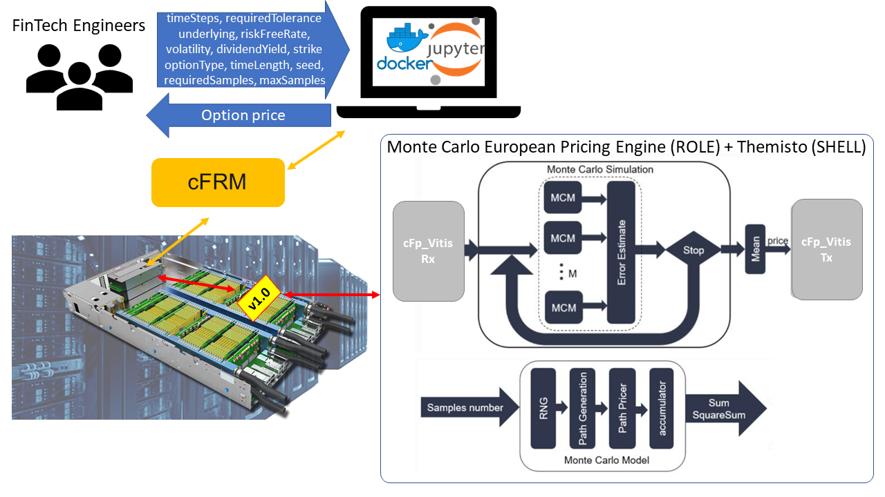

### cFp Monte Carlo European Pricing Engine

This is the implementation of a common option pricing engine, specifically the Monte Carlo European Option pricing engine (MCEuropeanEngine), on cloudFPGA platform. 
The MCEuropeanEngine IP is privided by the open source Xilinx ® Vitis™ Quantitative Finance library, which is a fundamental library aimed at providing a comprehensive FPGA acceleration library for quantitative finance. 
It is a free/open-source for a variety of real use cases, such as modeling, trading, evaluation, and risk management.
The Vitis Quantitative Finance library provides comprehensive tools from the bottom up for quantitative finance. 
It includes the lowest level modules and functions, the pre-defined middle kernel level, and the third level as pure software APIs working with pre-defined hardware overlays.

In Quantitative finance, option pricing is to calculate the perineum for purchasing for selling options. 
In options trading, option pricing models provide the finance professional a fair value to adjust their trading strategies and portfolios. 
The value of the options are calculated based on current value of the underlying asset, volatility of the underlying asset, dividends paid on the underlying asset, strike price of the option, time to expiration on the option and riskless interest rate.
The European option pricing engine estimates the value of option based on Monte Carlo simulation method and Black-Scholes model.

As the below figure shows, the Monte Carlo simulation process is accelerated by multiple Monte Carlo model (MCM) units operating in dataflow, and each sub-module in MCM working in pipeline.



All sub-modules in MCM are connected by HLS stream. The latency of pricing engines based on Monte Carlo simulation is:

`Number of cycles = requiredSamples * timeSteps / MCM:`

The `MCEuropeanEngine IP` is wrapped in an appropriate cFp_Vitis ROLE. Together with a `Themisto SHELL`, the final design can fit in a single FPGA and offer very low-latency option pricing acceleration.

More info for the `MCEuropeanEngine IP`: https://xilinx.github.io/Vitis_Libraries/quantitative_finance/2020.1/rst_L2/namespace_xf_fintech.html#cid-xf-fintech-mceuropeanengine .


#### Quick start

* `source <cFp_Vitis_directory>/env/setenv.sh`

* `cd $cFpRootDir/ROLE/quantitative_finance/hls/mceuropeanengine`

#### Run C++ simulation 

Since the source code of Vitis libraries is in C++, we have created a C++ testbench in order to simulate the corresponding kernel and verify its functionality.

##### Simulation with Vivado/Vitis HLS tool

* `make csim`

##### Simulation with native gcc

* `make fcsim -j 4`

#### Run HLS with Vivado/Vitis HLS tool

* `make csynth`


#### Device Utilization

| MCE    | CLBs     | CLBs (%) | BRAMs | BRAMs (%) | DSPs  | DSPs (%) | IOs | IOss (%) |
|:------:|---------:|---------:|------:|----------:|------:|---------:|----:|---------:|
| 7      | 41105    | 99.14    | 311.5 | 28.24     | 1271  | 46.05    | 520 | 54.23    |


#### Usefull commands

```
pip3 install snakeviz
python3 -m cProfile -o test.profile ../test.py
snakeviz test.profile

pip install QuantLib
pip2 install gprof2dot
pip3 install gprof2dot
python2 /home/ubuntu/.local/lib/python2.7/site-packages/gprof2dot.py -f pstats test_quantlib.profile | dot -Tpng -o output_quantlib.png && eog output_quantlib.png
python -m cProfile -o test_quantlib.profile ../test_quantlib.py
snakeviz test_quantlib.profile
```