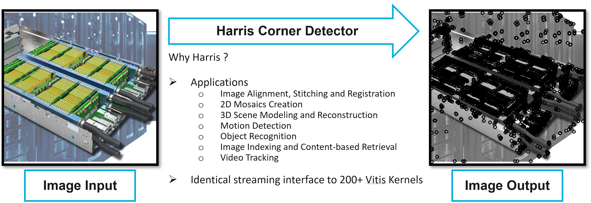
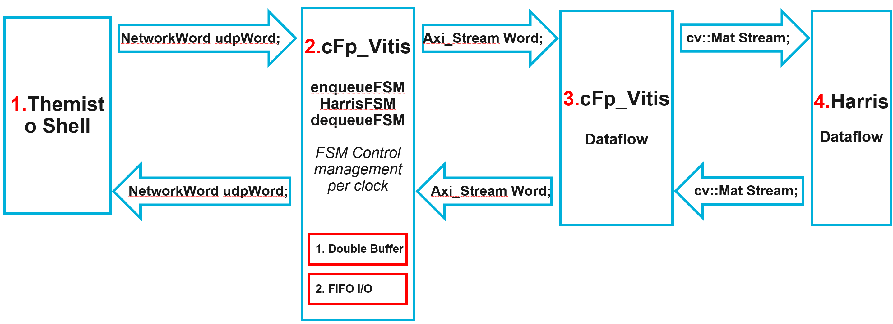
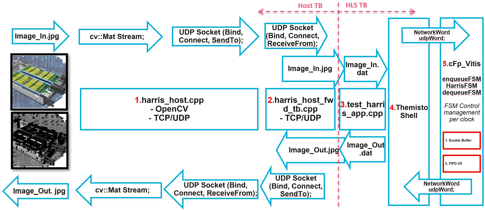

### cFp Harris Corner Detection

This is the implementation of the common Harris corner detector (Harris), on cloudFPGA platform. 
The Harris IP is privided by the open source Xilinx ® Vitis™ Vision library, which is a fundamental library aimed at providing a comprehensive FPGA acceleration library for computer vision algorithms. 




#### Repository and environment setup

```bash
git clone --recursive git@github.com:cloudFPGA/cFp_Zoo.git
cd cFp_Zoo
source ./env/setenv.sh
```


#### Intergration of Vitis Vision Harris with cloudFPGA

In the following figure it is shown how straightforward is to intergrate a function from Vitis libraries with cloudFPGA project.



Since most of Vitis libraries (in L1) are offered with a AXI stream I/F in dataflow mode, the most obvious approach to connect them to cF is to wrap this 
I/F with anohter I/F that takes care of carefully feeding (as well as sending the results back) to (from) the Harris IP from the network. 
For cFp_Zoo we are using the Themisto Shell already equipeed with a network streaming I/F for the user application. 
A small FSM takes care of the data casting between network and AXI streams.


#### Harris Simulation 

The testbench of Harris is highlighted below:



The testbench is offered in two flavors:
- HLS TB: The testbench of the C++/RTL. This is a typical Vivado HLS testbench but it includes the testing of Harris IP when this is wrapped in a [cF Themisto Shell](https://github.com/cloudFPGA/cFDK/blob/main/DOC/Themisto.md).
- Host TB: This includes the testing of a a host apllication (C++) that send/receives images over Ethernet (TCP/UDP) with a cF FPGA. This testbench establishes a socket-based connection with an intermediate listener which further calls the previous testbench. So practically, the 2nd tb is a wrapper of the 1st tb, but passing the I/O data over socket streams.
  For example this is the `system command` inside `Host TB` that calls the `HLS TB`:

This folder contains the mandatory files to proceed withthe 1st option, i.e. HLS TB
  
Basic files/module for the HLS TB:
  3. [test_harris.cpp](https://github.com/cloudFPGA/cFp_Zoo/blob/master/ROLE/vision/hls/harris/test/test_harris.cpp): The typical Vivado HLS testbench of Harris IP, when this is wrapped in a Themisto Shell.
  4. [Themisto Shell](https://github.com/cloudFPGA/cFDK/blob/main/DOC/Themisto.md): The SHELL-ROLE architecture of cF.
  5. [cFp_Zoo](https://github.com/cloudFPGA/cFp_Zoo): The project that bridges Vitis libraries with cF.

  
##### Harris image size 

The maximum image size, that the Harris IP is configured, is defined at https://github.com/cloudFPGA/cFp_Zoo/blob/master/HOST/vision/harris/languages/cplusplus/include/config.h 
through the `FRAME_HEIGHT` and `FRAME_WIDTH` definitions. These definitions have an impact of the FPGA resources. In the following simulations if the image 
provided has other dimensions, the `cv::resize` function will be used to adjust the image (scale) to `FRAME_HEIGHT x FRAME_WIDTH`.
  
**Note:** Remember to run `make clean` every time you change those definitions.
  
##### Run simulation

**HLS TB**
  
```bash
cd ./ROLE/vision/hls/harris_app
make fcsim -j 4  # to run simulation using your system's gcc (with 4 threads)
make csim   # to run simulation using Vivado's gcc
make cosim  # to run co-simulation using Vivado
```

**Optional steps**

```bash
cd ./ROLE/vision/hls/harris_app
make callgraph # to run fcsim and then execute the binary in Valgrind's callgraph tool
make kcachegrind # to run callgrah and then view the output in Kcachegrind tool
make memcheck # to run fcsim and then execute the binary in Valgrind's memcheck tool (to inspect memory leaks)
```


#### Harris Synthesis

Since curretnly the cFDK supports only Vivado(HLS) 2017.4 we are following a 2-steps synthesis 
procedure. Firstly we synthesize the Themisto SHELL with Vivado (HLS) 2017.4 and then we synthesize 
the rest of the project (including P&R and bitgen) with Vivado (HLS) > 2019.1. 

##### The Harris IP
This is only for the HLS of Harris (e.g. to check synthesizability)
```bash
cd cFp_Zoo/ROLE/vision/hls
make harris # with Vivado HLS >= 2019.1
```
or 
```bash
cd cFp_Zoo/ROLE/vision/hls/harris
make csynth # with Vivado HLS >= 2019.1
```
or
```bash
cd cFp_Zoo/ROLE/vision/hls/harris
vivado_hls -f run_hls.tcl # with Vivado HLS >= 2019.1
```

##### The Themisto SHELL
```bash
cd cFp_Zoo/cFDK/SRA/LIB/SHELL/Themisto
make all # with Vivado HLS == 2019.1
```

##### The complete cFp_Zoo
```bash
cd cFp_Zoo
make monolithic # with Vivado HLS >= 2019.1
```

More info for the Harris IP: https://xilinx.github.io/Vitis_Libraries/vision/api-reference.html#harris-corner-detection


##### Troubleshooting

* ```
  Vivado libstdc++.so.6: version CXXABI_1.3.11 not found (required by /lib64/libtbb.so.2)`
  ```
  Fix: `cp /usr/lib64/libstdc++.so.6 /tools/Xilinx/Vivado/2020.1/lib/lnx64.o/Default/libstdc++.so.6`

*
  ```
  /lib64/libtbb.so.2: undefined reference to `__cxa_init_primary_exception@CXXABI_1.3.11'
  /lib64/libtbb.so.2: undefined reference to `std::__exception_ptr::exception_ptr::exception_ptr(void*)@CXXABI_1.3.11'
  ```
  Fix: `csim_design -ldflags "-L/usr/lib/gcc/x86_64-redhat-linux/8/ ${OPENCV_LIB_FLAGS} ${OPENCV_LIB_REF}" -clean -argv "${SimFile}"`
